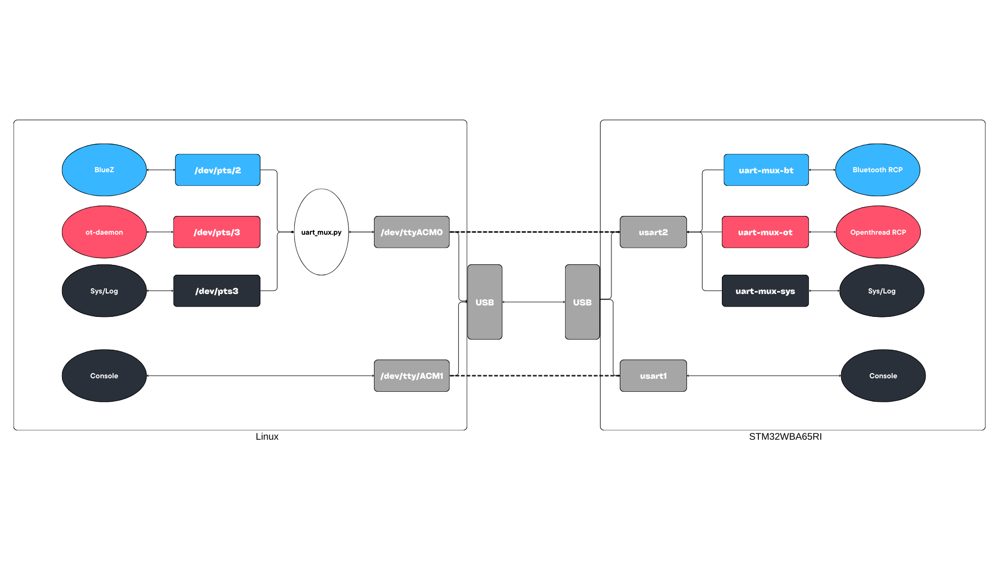

====================================================
User Guide: NUCLEO to Ubuntu RCP Setup
====================================================

Overview
********
This guide describes how to set up a system composed of a **NUCLEO-WBA board** connected to an **Ubuntu/Linux PC**. The system runs an OpenThread and BLE Radio Co-Processor (RCP) application, using a UART multiplexer to share a single connection for multiple protocol stacks.

System Architecture
===================

The NUCLEO board communicates with the Ubuntu host via a physical UART. On the PC, a Python script bridges this physical port to virtual ports (PTYs) for BlueZ (BLE), OpenThread (Spinel), and System Logs.

Hardware Setup
**************
To enable **RTS/CTS hardware flow control**, specific solder bridges must be configured based on your board model. This is required for high-speed, reliable communication at 2 Mbps.

NUCLEO-WBA65RI (USART2)
=======================
Configure the **MB1801** mezzanine board as follows:

+-----------------+------------------+---------------------------------------------+
| Solder Bridge   | Position         | Function                                    |
+=================+==================+=============================================+
| **SB4**         | **ON** (Closed)  | Connects USART2_RTS (PA15) to ST-LINK CTS   |
+-----------------+------------------+---------------------------------------------+
| **SB7**         | **OFF** (Open)   | Disconnects alternative PA15 routing        |
+-----------------+------------------+---------------------------------------------+

NUCLEO-WBA55CG (LPUART1)
========================
The following configurations are required across the mezzanine and MCU boards:

**MB1801 Mezzanine Board (VCP2 & Routing)**

+-----------------+------------------+---------------------------------------------+
| Solder Bridge   | Position         | Function                                    |
+=================+==================+=============================================+
| **SB7**         | **ON** (Closed)  | Connects LPUART1_RX (PA10) to ST-LINK TX    |
+-----------------+------------------+---------------------------------------------+
| **SB8**         | **ON** (Closed)  | Connects LPUART1_TX (PB5) to ST-LINK RX     |
+-----------------+------------------+---------------------------------------------+
| **SB25**        | **ON** (Closed)  | Routes ST-LINK_RTS towards the SoC CTS path |
+-----------------+------------------+---------------------------------------------+
| **SB23**        | **ON** (Closed)  | Routes ST-LINK_CTS towards the SoC RTS path |
+-----------------+------------------+---------------------------------------------+

**MB1803 MCU RF Board (Pin Selection)**

+-----------------+------------------+---------------------------------------------+
| Solder Bridge   | Position         | Function                                    |
+=================+==================+=============================================+
| **SB32**        | **ON** (Closed)  | Connects CTS signal to PB15                 |
+-----------------+------------------+---------------------------------------------+
| **SB31**        | **OFF** (Open)   | Disconnects alternative PB15 path           |
+-----------------+------------------+---------------------------------------------+
| **SB25**        | **ON** (Closed)  | Connects RTS signal to PB9                  |
+-----------------+------------------+---------------------------------------------+
| **SB23**        | **OFF** (Open)   | Disconnects alternative PB9 path            |
+-----------------+------------------+---------------------------------------------+

.. warning::
   Enabling VCP2 replaces the ST-LINK mass‑storage interface. Use a fine-tip soldering iron and verify against manuals UM3448 (WBA65RI) or UM3301 (WBA55CG).

Software Setup
**************

Ubuntu Configuration
====================
1. **Permissions**: Add your user to the dialout group to access serial ports:
   
   .. code-block:: bash

      sudo usermod -aG dialout $USER

   *(Note: You must log out and back in for changes to apply).*

2. **Conflict Resolution**: Disable ModemManager to prevent it from attempting to send AT commands to the NUCLEO board:
   
   .. code-block:: bash

      sudo systemctl disable --now ModemManager

3. **ST-LINK Rules**: Create a file at ``/etc/udev/rules.d/49-stlinkv3.rules`` to allow access to the ST-LINK/V3 bridge without root permissions:

   .. code-block:: text

      SUBSYSTEMS=="usb", ATTRS{idVendor}=="0483", ATTRS{idProduct}=="374d", MODE="0666", GROUP="dialout"
      SUBSYSTEMS=="usb", ATTRS{idVendor}=="0483", ATTRS{idProduct}=="374e", MODE="0666", GROUP="dialout"
      SUBSYSTEMS=="usb", ATTRS{idVendor}=="0483", ATTRS{idProduct}=="374f", MODE="0666", GROUP="dialout"

NUCLEO configuration
====================
If you do not wish to build the firmware from source using Zephyr/West, you can flash the provided pre-compiled binary directly:

1. Connect your NUCLEO board to your PC via USB.
2. Open **STM32CubeProgrammer**.
3. Select the provided ``.bin`` or ``.elf`` file for your specific board model.
4. Click **Connect** and then **Start Programming**.

Testing the system
******************

Multiplexer Startup and Status
==============================
The :file:`uart_mux_asyncio.py` script bridges a single physical UART port to multiple virtual PTYs.
This allows you to run:

* A BLE stack (e.g., BlueZ via HCI)
* An OpenThread stack (via Spinel)
* A system console or management interface

all over the same physical UART.

The usage is identical for **NUCLEO-WBA65RI** and **NUCLEO-WBA55CG**.

1. **Install Dependencies**:
   
   .. code-block:: bash

      pip install pyserial-asyncio

2. **Launch Script**:
   
   .. code-block:: bash

      # Replace /dev/ttyACM1 with your board's secondary VCP port
      sudo python3 uart_mux_asyncio.py --port /dev/ttyACM1 --baudrate 2000000 --bt-attach --ot-manager ot-daemon

.. note::
   The script requires root access to spawn the bluetooth and openthread processes. It also requires `btattach` and/or `ot-daemon` executables in the path when
   the options `--bt-attach` and/or `--ot-manager ot-daemon` are specified.

3. **Monitor Connection Status**:
   While the script is running, it provides real-time logging. Press the **'i'** key at any time to display the current connection status:

   .. code-block:: text

      ============================================================
                      UART MULTIPLEXER STATUS
      ============================================================
       Date:        2026-01-18 12:04:16.100161
       Port:        /dev/ttyACM1
       Baudrate:    2000000
       Flow Ctrl:   Hardware (RTS/CTS)
       Bluetooth:   Active on /dev/pts/3 (PID: 3329203)
       HCI Intf:    hci0
       OT daemon:   ot-daemon active on /dev/pts/4 (PID: 3329213)
      ------------------------------------------------------------
       CHANNEL      | PTY DEVICE
      ------------------------------------------------------------
       BLE          | /dev/pts/3
       OT           | /dev/pts/4
       System       | /dev/pts/5
      ------------------------------------------------------------
       [ Press 'i' to show this status  |  'q' to Exit  |  
         Ctrl+C to Exit ]
      ============================================================

Bluetooth (BLE) Validation
==========================
With the multiplexer running and the ``--bt-attach`` flag used, the virtual BLE channel is automatically linked to the BlueZ stack.

1. **Identify the Interface**:
   If your PC has multiple Bluetooth controllers (e.g., an internal card and the NUCLEO), verify which interface belongs to the NUCLEO by pressing **'i'** in the multiplexer terminal. Look for the **HCI Intf** line (e.g., ``hci0`` or ``hci1``).

2. **Perform a Low Energy Scan**:
   Use the specific interface identified above to scan for advertising packets:
   
   .. code-block:: bash

      # Replace hci0 with the interface listed in the status table
      sudo hcitool -i hci0 lescan --duplicates

OpenThread Validation
=====================
If the multiplexer was started with the ``--ot-manager ot-daemon`` flag, the ``ot-daemon`` will connect to the virtual PTY automatically.

1. **Check Node State**:
   Verify the RCP is communicating with the daemon:
   
   .. code-block:: bash

      sudo ot-ctl state

2. **Network Discovery**:
   Perform an active scan to verify the 802.15.4 radio:
   
   .. code-block:: bash

      sudo ot-ctl scan

Troubleshooting
***************

Debug Console
=============
The NUCLEO firmware provides a debug console for system events. 
Connect a serial terminal (like Minicom or PuTTY) to the **NUCLEO first Virtual COM port** (e.g., ``/dev/ttyACM0``) using a baudrate of **115200**. 

.. code-block:: bash

   # Connect to the first VCP (ACM0)
   sudo minicom -D /dev/ttyACM0 -b 115200

After pressing the **Reset** button on the NUCLEO board, you should see initialization logs and system status messages.

Multiplexer Verbose Logging
===========================
If the protocol stacks are not connecting or data is not flowing, restart the multiplexer script with extra debugging flags to inspect the raw packets exchanged:

.. code-block:: bash

   sudo python3 uart_mux_asyncio.py --port /dev/ttyACM1 --baudrate 2000000 --log-level DEBUG --log-rx --log-tx

